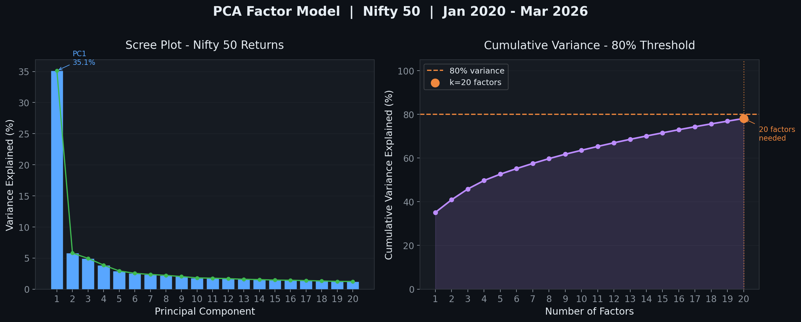

# Nifty 50 PCA Factor Model
Statistical factor model extracting latent risk factors from NSE 
returns using PCA, benchmarked against Fama-French 3-Factor model.

## Key Findings
- PC1 explains **35.1%** of cross-stock variance — the market beta factor
- PC1 achieves **r = 0.96** with Nifty index return — validates FF3 MKT factor
- **20 PCs** needed to explain 80% of variance (FF3 explains ~50%)
- PC2 captures IT vs PSU/commodity structural split
- PC3 isolates commodity shock (Russia-Ukraine, 2022) — absent from FF3

## Usage
pip install -r requirements.txt
python pca_factor_model.py

## Method
Downloads adjusted closing prices for Nifty 50 constituents via yfinance. 
Computes daily log-returns, standardises, and applies sklearn PCA to the 
(T × N) covariance matrix. Fama-French proxies are constructed from price 
history and correlated against PCA factor time-series using Pearson r.
